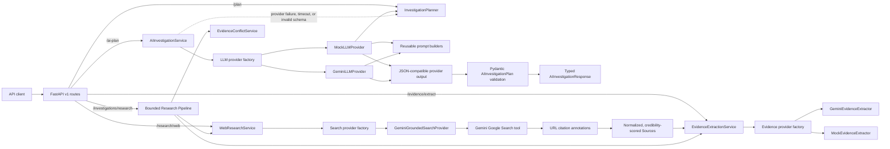
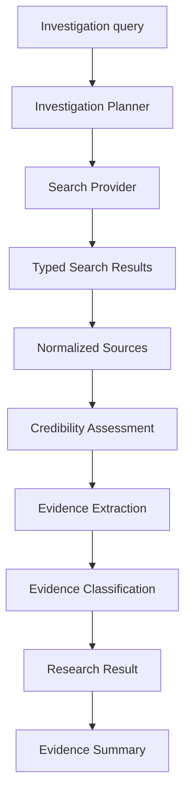
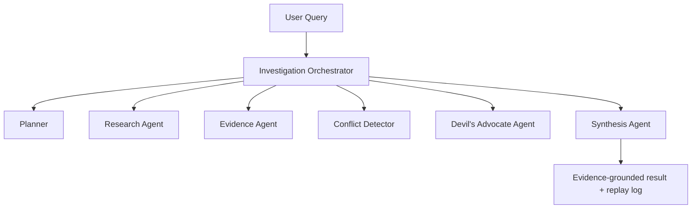

# AI Investigation Engine

AI Investigation Engine is a FastAPI service that converts an investigation
query into a structured research plan. It supports both a deterministic planner
and a provider-independent AI planning flow. The offline `mock` provider remains
the default; an opt-in Google Gemini adapter can make real model calls when
explicitly configured with an API key and model name. A separate opt-in Gemini
Google Search grounding path returns normalized, citation-backed web sources.
An independently configured Gemini evidence adapter can classify only the
source material supplied to it and preserve validated provenance.

## Current features

- Strict Pydantic request and response schemas.
- Investigation depths: `quick`, `standard`, and `deep`.
- Deterministic classification into six investigation categories.
- Category-aware research angles.
- Structured, prioritized sub-questions.
- Versioned planning API under `/api/v1`.
- Consistent validation and application error responses.
- Environment-backed application settings without `pydantic-settings`.
- Vendor-neutral asynchronous `LLMProvider` abstraction.
- Local `MockLLMProvider` with schema-validated output.
- Official `google-genai` adapter with async structured JSON generation.
- Reusable prompt builders shared by mock and Gemini providers.
- Explicit provider/model/fallback metadata on AI planning responses.
- Labeled deterministic fallback for provider failures or invalid model output.
- Provider-independent asynchronous search abstraction.
- Deterministic mock search data on reserved example domains.
- Gemini Google Search grounding through the official `google-genai` SDK.
- Citation-annotation-only URL extraction, normalization, and deduplication.
- Grounded source provenance and source-quality heuristic assessment.
- Explainable source-quality scoring with explicit caveats.
- Provenance-preserving evidence extraction and stance classification.
- Strict Gemini evidence extraction with structured JSON and source allowlists.
- Conflict detection for opposing source claims without a truth verdict.
- Bounded end-to-end investigation research with explicit partial failures.
- Bounded agentic orchestration with research, evidence, critic, conflict, and
  synthesis agents plus a public replay log.
- Provider-neutral asynchronous embeddings, deterministic chunking, semantic
  retrieval, and duplicate-safe in-memory vector indexing.
- Optional RAG grounding in the agentic workflow through `use_rag`.
- Structured evidence summaries without final truth verdicts.
- Pytest and HTTP-level ASGI endpoint tests.

Gemini planning, Gemini Google Search grounding, Gemini evidence extraction,
and Gemini embeddings are the optional external integrations. No third-party
search SDK, autonomous crawler, external vector database, authentication layer,
or persistence service is connected.

## Architecture



### RAG and semantic retrieval

```text
Sources
  ↓
Chunker
  ↓
Embedding Provider
  ↓
Vector Store
  ↓
Semantic Retriever
  ↓
Evidence / Agentic Investigation
```

An embedding is a numeric representation of text. Similar meanings tend to
produce vectors with higher cosine similarity, allowing a query to retrieve
relevant passages even when it does not repeat the source's exact wording.
Chunking keeps the retrieved context bounded, and RAG passes only the highest
ranking validated passages forward instead of every collected source passage.
This reduces irrelevant context; it does not prove that a retrieved passage is
correct.

`EmbeddingProvider` isolates model-specific embedding calls. The deterministic
`MockEmbeddingProvider` is the offline default, while
`GeminiEmbeddingProvider` uses the existing `google-genai` SDK,
`GEMINI_API_KEY`, and the configured `EMBEDDING_MODEL`. Model names are never
selected inside the Gemini adapter. `VectorStore` similarly isolates storage;
Phase 7 intentionally implements only `InMemoryVectorStore`.

Every chunk carries its original source ID and URL, title, optional
section/location, character offsets, deterministic chunk ID, and SHA-256
content hash. Retrieval returns those same values. Before retrieved text reaches
the existing evidence agent, the orchestrator verifies the source ID/URL pair,
title, content hash, and verbatim membership in the normalized source content.
It never invents or repairs source provenance.

### Deterministic and AI-provider flows

| Flow | Endpoint | Implementation | Intended use |
| --- | --- | --- | --- |
| Deterministic | `POST /api/v1/investigations/plan` | Local `InvestigationPlanner` | Stable baseline and fallback |
| AI-style | `POST /api/v1/investigations/ai-plan` | Configured `LLMProvider` through `AIInvestigationService` | Provider-independent integration boundary |

Both flows preserve the `status` and `plan` envelope. The AI-style response also
identifies `provider_used`, `model_used`, and `fallback_used`. Its plan adds a
research objective, explicit assumptions, expected evidence types, and
potential biases. All provider output is validated before it reaches the API
response.

### Current mock provider

`MockLLMProvider` implements the same asynchronous contract intended for future
real providers. It builds the future planning prompt, generates realistic
structured data locally, and returns JSON-compatible output. Its behavior is
deterministic and uses no network calls, API keys, model SDKs, or usage charges.

### Optional Gemini provider

`GeminiLLMProvider` uses the official `google-genai` SDK and the same
vendor-neutral `LLMProvider` contract. It sends the existing planning prompt
through the SDK's asynchronous API, requests `application/json` with the
`AIInvestigationPlan` JSON schema, and validates the returned JSON with
Pydantic. Empty, malformed, schema-invalid, timed-out, and provider-error
responses are never treated as successful AI output.

When fallback is needed, the API reports `provider_used: "deterministic"` and
`fallback_used: true`, along with a sanitized `provider_error`. It does not label
the locally generated plan as Gemini output.

### Future provider adapters

Future OpenAI or Anthropic adapters should implement only `LLMProvider` and
translate provider-specific responses into the neutral structured output
contract. Vendor SDK objects, authentication, and error types remain inside
their adapter modules.

## Research and evidence pipeline



### Bounded agentic workflow



The agents are application-level services, not autonomous processes. A request
can execute at most two primary sub-questions, three sources per question, two
critic rounds, and three sources per critic query. There is no recursion,
self-scheduling, or open-ended tool loop.

The critic deliberately looks for strong evidence against the current leading
interpretation. It records assumptions that may be wrong, deduplicates known
source URLs, and treats a search that finds no opposing evidence as a gap rather
than confirmation or contradiction. The synthesis reports confidence in the
completeness and consistency of the evidence picture, never the probability
that a claim is true.

Every orchestrator action appends a typed replay step with timestamps,
provider/model metadata, concise action summaries, counts, warnings/errors, and
source/evidence references. The replay log contains no hidden chain-of-thought
or private model reasoning. Provider failures produce partial output whenever
validated sources or evidence remain, and mock sources are never substituted
after a real research failure.

### Provenance

Every evidence item retains the supplied source ID and URL, the exact relevant
passage, retrieval timestamp, extraction method, model identifier, rationale,
optional location, and a SHA-256 content hash. The Gemini extractor validates
every evidence source ID/URL pair and requires the passage to be a verbatim
substring of supplied source material. Unknown, changed, duplicated, or omitted
sources fail the extraction; they are never silently dropped or fabricated.

### Source-quality scoring is not truth

The current credibility service uses explainable metadata heuristics: source
type, author availability, publication date, HTTPS, publisher/domain
information, and reference or citation metadata. Its `high`, `moderate`, `low`,
and `unknown` levels estimate source quality only. They do not prove that a
statement is accurate, complete, unbiased, or true.

### Grounded web research

`GeminiGroundedSearchProvider` implements the vendor-neutral `SearchProvider`
contract with Gemini's built-in Google Search tool. The adapter accepts URLs
only from `url_citation` annotations returned by grounding metadata. URLs in
model prose are ignored. Valid URLs are normalized, stripped of common tracking
parameters and fragments, deduplicated, capped by `max_results`, and converted
to typed `Source` records.

The standalone web path stops after source normalization and credibility
assessment. It does not run an evidence extractor or make a truth determination.
The end-to-end investigation path passes those normalized sources to the
configured evidence extractor and never substitutes mock search sources after a
real search failure.

## Project structure

```text
AI-Investigation-Engine/
├── app/
│   ├── __init__.py
│   ├── main.py
│   ├── ai/
│   │   ├── __init__.py
│   │   ├── base.py
│   │   ├── factory.py
│   │   ├── mock_provider.py
│   │   └── prompts.py
│   ├── api/
│   │   ├── __init__.py
│   │   ├── routes.py
│   │   └── v1/
│   │       ├── __init__.py
│   │       ├── research_routes.py
│   │       └── routes.py
│   ├── core/
│   │   ├── __init__.py
│   │   ├── config.py
│   │   └── exceptions.py
│   ├── evidence/
│   │   ├── __init__.py
│   │   ├── base.py
│   │   └── mock_extractor.py
│   ├── research/
│   │   ├── __init__.py
│   │   └── search/
│   │       ├── __init__.py
│   │       ├── base.py
│   │       ├── factory.py
│   │       └── mock_provider.py
│   ├── schemas/
│   │   ├── __init__.py
│   │   ├── common.py
│   │   ├── evidence.py
│   │   ├── investigation.py
│   │   ├── research.py
│   │   └── source.py
│   └── services/
│       ├── __init__.py
│       ├── ai_investigation_service.py
│       ├── evidence_summary_service.py
│       ├── investigation_service.py
│       ├── research_service.py
│       └── source_credibility_service.py
├── tests/
│   ├── __init__.py
│   ├── test_ai_provider.py
│   ├── test_ai_service.py
│   ├── test_api.py
│   ├── test_evidence_pipeline.py
│   ├── test_investigation_planner.py
│   ├── test_research_api.py
│   ├── test_search_provider.py
│   └── test_source_credibility.py
├── .env.example
├── .gitignore
├── README.md
├── requirements-dev.txt
└── requirements.txt
```

Gemini-specific additions include `app/ai/gemini_provider.py`,
`app/research/search/gemini_grounded_provider.py`,
`app/evidence/gemini_extractor.py`, `app/evidence/factory.py`,
`app/services/evidence_conflict_service.py`,
`app/services/investigation_research_service.py`, and the guarded scripts under
`scripts/`. The bounded Phase 6 workflow lives in `app/agents/`, with its public
state and replay schemas in `app/schemas/agentic.py`.
Phase 7 retrieval code lives in `app/rag/`, with typed public schemas in
`app/schemas/rag.py`, HTTP routes in `app/api/v1/rag_routes.py`, and indexing
and retrieval application services under `app/services/`.

## Run locally

Activate the existing virtual environment, then start the API from the project
root:

```powershell
python -m uvicorn app.main:app --reload
```

Interactive OpenAPI documentation is available at:

- `http://127.0.0.1:8000/docs`
- `http://127.0.0.1:8000/redoc`

The application reads these optional environment variables:

| Variable | Default |
| --- | --- |
| `APP_NAME` | `AI Investigation Engine` |
| `APP_VERSION` | `0.6.0` |
| `ENVIRONMENT` | `development` |
| `DEBUG` | `false` |
| `LLM_PROVIDER` | `mock` |
| `LLM_MODEL` | `mock-investigator` |
| `LLM_TIMEOUT_SECONDS` | `60` |
| `GEMINI_API_KEY` | unset |
| `EVIDENCE_PROVIDER` | `mock` |
| `EVIDENCE_MODEL` | `gemini-3.6-flash` |
| `SEARCH_PROVIDER` | `mock` |
| `SEARCH_MODEL` | `gemini-3.6-flash` |
| `SEARCH_MAX_RESULTS` | `5` |
| `EMBEDDING_PROVIDER` | `mock` |
| `EMBEDDING_MODEL` | `mock-embedding-v1` |
| `VECTOR_STORE_PROVIDER` | `in_memory` |
| `RAG_CHUNK_SIZE` | `1000` |
| `RAG_CHUNK_OVERLAP` | `200` |

The application loads a project-root `.env` file when present. Explicit process
environment variables take precedence. Set `APP_ENV_FILE` to another path to
load a different file, or to an empty value to disable file loading. Keep the
offline defaults for normal development. To enable Gemini in the current
PowerShell process:

```powershell
$env:LLM_PROVIDER="gemini"
$env:LLM_MODEL="gemini-3.6-flash"
$env:GEMINI_API_KEY="<your-api-key>"
python -m uvicorn app.main:app --reload
```

The model identifier is configuration, not provider code. Re-check Google's
model lifecycle documentation before production deployment.

Run the optional one-request integration check only when the key is present:

```powershell
$env:GEMINI_API_KEY="<your-api-key>"
$env:LLM_MODEL="gemini-3.6-flash"
python -m scripts.test_gemini
```

Run one real grounded web-research request:

```powershell
python -m scripts.test_web_research
```

Run one deliberately small real end-to-end investigation (one quick
sub-question and at most two sources):

```powershell
$env:EVIDENCE_PROVIDER="gemini"
$env:EVIDENCE_MODEL="gemini-3.6-flash"
python -m scripts.test_real_investigation
```

Run one small real agentic investigation with one primary question, two sources,
and one critic round:

```powershell
python -m scripts.test_agentic_investigation
```

Run the optional real Gemini embedding smoke test with one configured model and
two tiny strings:

```powershell
$env:EMBEDDING_PROVIDER="gemini"
$env:EMBEDDING_MODEL="<supported-embedding-model>"
python -m scripts.test_gemini_embeddings
```

All real scripts require `GEMINI_API_KEY`. They never print the key. Model and
grounded-search usage may consume quota or incur charges, so these scripts are
opt-in and are never run by the automated test suite.

## API endpoints

| Method | Path | Purpose |
| --- | --- | --- |
| `GET` | `/` | Basic service information |
| `GET` | `/health` | Health and environment status |
| `POST` | `/api/v1/investigations/plan` | Generate a deterministic investigation plan |
| `POST` | `/api/v1/investigations/ai-plan` | Generate a provider-backed AI-style plan |
| `POST` | `/api/v1/investigations/research` | Run bounded grounded research, evidence extraction, conflict detection, and summary |
| `POST` | `/api/v1/investigations/agentic` | Run the bounded research/evidence/critic/synthesis workflow with replay metadata |
| `POST` | `/api/v1/research/mock` | Run the offline mock research/evidence pipeline |
| `POST` | `/api/v1/research/web` | Run real Gemini Google Search grounding and normalize cited sources |
| `POST` | `/api/v1/evidence/extract` | Extract strictly source-grounded evidence with the configured evidence provider |
| `POST` | `/api/v1/evidence/summary` | Summarize evidence counts and unresolved conflicts |
| `POST` | `/api/v1/rag/index` | Chunk, embed, and index normalized source content |
| `POST` | `/api/v1/rag/search` | Retrieve the highest-cosine matching source chunks |
| `GET` | `/api/v1/rag/stats` | Inspect non-secret in-memory vector-store statistics |

### Planning request

```json
{
  "query": "Research renewable energy storage",
  "depth": "standard"
}
```

`depth` is optional and defaults to `standard`.

### Planning response

```json
{
  "status": "investigation_planned",
  "plan": {
    "query": "Research renewable energy storage",
    "depth": "standard",
    "category": "research_topic",
    "research_angles": [
      {
        "angle": "definitions_and_scope",
        "description": "Clarify key terms, entities, timeframe, and investigation boundaries."
      },
      {
        "angle": "source_credibility",
        "description": "Assess source authority, independence, methodology, and potential bias."
      },
      {
        "angle": "historical_context",
        "description": "Establish the background and timeline needed to interpret the topic."
      },
      {
        "angle": "supporting_evidence",
        "description": "Identify reliable evidence that supports the central assertions."
      },
      {
        "angle": "contradicting_evidence",
        "description": "Actively look for evidence that challenges or weakens the assertions."
      }
    ],
    "sub_questions": [
      {
        "id": "sq-01",
        "question": "Which terms, entities, timeframe, and scope must be defined for \"Research renewable energy storage\"?",
        "purpose": "Clarify key terms, entities, timeframe, and investigation boundaries.",
        "priority": 1
      },
      {
        "id": "sq-02",
        "question": "Which primary or authoritative sources are best suited to investigate \"Research renewable energy storage\", and why?",
        "purpose": "Assess source authority, independence, methodology, and potential bias.",
        "priority": 2
      },
      {
        "id": "sq-03",
        "question": "What historical context and timeline are necessary to understand \"Research renewable energy storage\"?",
        "purpose": "Establish the background and timeline needed to interpret the topic.",
        "priority": 3
      },
      {
        "id": "sq-04",
        "question": "What reliable evidence supports the central assertions in \"Research renewable energy storage\"?",
        "purpose": "Identify reliable evidence that supports the central assertions.",
        "priority": 4
      },
      {
        "id": "sq-05",
        "question": "What credible evidence contradicts or weakens the assertions in \"Research renewable energy storage\"?",
        "purpose": "Actively look for evidence that challenges or weakens the assertions.",
        "priority": 5
      }
    ]
  }
}
```

### Validation errors

Invalid input returns HTTP `422` with a consistent error body:

```json
{
  "code": "validation_error",
  "message": "Request validation failed",
  "details": [
    {
      "field": "query",
      "message": "String should have at least 5 characters",
      "type": "string_too_short"
    }
  ]
}
```

The query is trimmed, must be a string, and must contain at least five
characters. Additional request fields are rejected. Depth must be `quick`,
`standard`, or `deep`.

### AI-style planning request

```json
{
  "query": "Compare solar power versus wind power",
  "depth": "quick"
}
```

Send this body to `POST /api/v1/investigations/ai-plan`. The response keeps the
`status` and `plan` envelope and includes:

- `research_objective` with explicit success criteria.
- `assumptions` that require validation.
- Structured `research_angles` and prioritized `sub_questions`.
- `expected_evidence_types`.
- `potential_biases` with mitigations.
- `provider_used`, `model_used`, and `fallback_used` metadata.
- An optional sanitized `provider_error` when fallback was required.

For the default `mock` provider, repeated requests with the same query and depth
produce the same response.

### Grounded web research request

```json
{
  "query": "What are the latest official developments in long-duration energy storage?",
  "max_results": 5
}
```

Send this body to `POST /api/v1/research/web`. The response contains the query,
`provider_used`, `model_used`, normalized and credibility-scored `sources`, a
`grounded_summary`, citation annotations and search-query metadata, and
warnings. A citation includes its normalized source URL, source title, optional
cited text and offsets, and the normalized source ID.

If Gemini returns no usable `url_citation` metadata, `sources` and citations are
empty and the response includes an explicit warning. The service never derives
a source URL from generated prose.

Gemini 3 Google Search grounding is billed per search query executed by the
model, and one API request can execute multiple billable queries. Review the
[official grounding pricing guidance](https://ai.google.dev/gemini-api/docs/google-search#pricing)
and project quota before enabling the web endpoint.

### Mock research request

```json
{
  "investigation_query": "Research renewable energy storage",
  "sub_question": "Which primary sources describe long-duration storage?",
  "max_results": 3,
  "depth": "deep"
}
```

Send this body to `POST /api/v1/research/mock`. `sub_question` is optional; when
it is omitted, the research service selects the highest-priority sub-question
from the generated investigation plan.

The response is a typed `ResearchResult` containing:

- The investigation query, depth, and selected sub-question.
- Normalized sources with metadata and credibility assessments.
- Evidence items with stance, strength, and complete provenance.
- Counts for `supports`, `contradicts`, `neutral`, and `insufficient`.
- Warnings about low-quality sources and heuristic limitations.

### Evidence extraction request

```json
{
  "query": "Long-duration storage improved discharge duration",
  "sub_question": "Does the supplied source support the duration claim?",
  "sources": [
    {
      "source_id": "source-001",
      "title": "Official storage trial report",
      "url": "https://agency.example/storage/report",
      "domain": "agency.example",
      "retrieved_at": "2026-08-11T12:00:00Z",
      "source_type": "government",
      "snippet": "The trial reported a twelve-hour discharge duration.",
      "metadata": {},
      "credibility": null,
      "author": null,
      "publisher": null,
      "published_at": null
    }
  ]
}
```

Send this body to `POST /api/v1/evidence/extract`. `EVIDENCE_PROVIDER=mock`
selects the labeled deterministic development extractor;
`EVIDENCE_PROVIDER=gemini` selects `GeminiEvidenceExtractor` and additionally
requires `EVIDENCE_MODEL` and `GEMINI_API_KEY`. Gemini receives only the supplied
title/snippet material. Its structured response must preserve every source ID
and URL and copy each passage verbatim. Any unknown source or fabricated passage
causes a typed provider error instead of a partial evidence list.

The response contains `provider_used`, `model_used`, typed `evidence_items`,
`stance_counts`, and warnings. Stances are `supports`, `contradicts`, `neutral`,
or `insufficient`; strengths are `strong`, `moderate`, `weak`, or `unknown`.
Missing evidence is classified as `insufficient`, never as contradiction.

### End-to-end investigation research request

```json
{
  "query": "Research long-duration energy storage performance",
  "depth": "quick",
  "max_sub_questions": 1,
  "max_sources_per_question": 2
}
```

Send this body to `POST /api/v1/investigations/research`. The service creates a
deterministic plan, selects the highest-priority questions, performs real Gemini
grounded search, normalizes and scores returned sources, invokes the configured
evidence extractor, detects opposing source claims, and produces an evidence
summary without a truth verdict.

Cost controls are enforced by request validation: `max_sub_questions` defaults
to 2 and cannot exceed 2; `max_sources_per_question` defaults to 3 and cannot
exceed 3. Grounded-search retry behavior is separately bounded to three attempts.
If web research is rate-limited, the response status is `partial` when earlier
questions completed or `failed` when none completed, with typed retry metadata.
No mock sources are substituted.

### Agentic investigation request

```json
{
  "query": "Research long-duration energy storage performance",
  "depth": "quick",
  "max_sub_questions": 1,
  "max_sources_per_question": 2,
  "run_critic": true,
  "max_critic_rounds": 1,
  "use_rag": false
}
```

Send this body to `POST /api/v1/investigations/agentic`. The orchestrator runs a
finite planner -> research -> evidence -> conflict -> critic -> synthesis
sequence. Primary research is limited to 2 sub-questions and 3 sources per
question. The critic defaults to one research round, has a hard maximum of 2,
and can request at most 3 sources per round. It challenges the current leading
interpretation; a failed search or lack of opposing evidence is recorded as an
evidence gap rather than a contradiction.

`use_rag` defaults to `false`, preserving the Phase 6 execution path. When it
is `true`, each primary question's usable normalized source content is chunked
and indexed, the sub-question retrieves its most relevant chunks, and only
chunks that pass provenance validation are supplied to evidence extraction. The
replay log adds explicit RAG indexing and retrieval steps.

The response contains the complete typed state plus an ordered `audit_trail`.
Each audit step exposes status, timestamps, provider/model metadata, concise
action summaries, evidence references, counts, warnings, and typed errors. It
does not expose private model reasoning. Successful work is retained when a
later question, source extraction, critic search, or provider call fails, so the
result can be `partial` without fabricated replacement sources. Synthesis
confidence describes the completeness and consistency of the evidence picture;
it is not a probability that the investigated claim is true, and no binary
truth verdict is returned.

### Evidence summary request

Send a complete `ResearchResult` to `POST /api/v1/evidence/summary`. The response
contains supporting, contradicting, neutral, and insufficient counts; the
strongest supporting and contradicting items; and unresolved conflicts. It
intentionally contains no final truth verdict.

## Tests and verification

Install runtime dependencies only:

```powershell
python -m pip install -r requirements.txt
```

For development and tests, use the separate dependency file:

```powershell
python -m pip install -r requirements-dev.txt
```

Run the test suite:

```powershell
python -m pytest
```

Source compilation can be checked with:

```powershell
python -m compileall app
```

## API-key security

- Never commit a real `.env` file or credentials.
- `.env.example` contains empty placeholders only.
- Supply `GEMINI_API_KEY` through the environment or a secret manager.
- Do not log API keys, authorization headers, or raw provider credentials.
- Provider authentication remains isolated inside its adapter module.

## Current limitations

- Gemini planning, grounded web research, and evidence extraction are opt-in
  and may incur usage charges or quota consumption.
- The deterministic mock remains the default for offline development and tests.
- The mock endpoint still uses deterministic records on reserved domains.
- The web endpoint depends on Gemini returning usable citation annotations.
- Grounding metadata generally does not provide author or publication-date
  metadata, which lowers heuristic source-quality scores.
- Evidence extraction can use only supplied source titles/snippets; it does not
  fetch full page content. A classification is limited by that supplied text.
- Category detection uses local pattern matching rather than a trained model.
- Planning prompts are sent externally only when `LLM_PROVIDER=gemini`;
  evidence prompts are sent externally only when `EVIDENCE_PROVIDER=gemini`.
- RAG can index only the normalized content supplied to it. The current research
  providers usually supply titles/snippets rather than complete documents.
- `InMemoryVectorStore` is process-local, is cleared on restart, is not shared
  across workers, and is unsuitable as durable production storage. A future
  phase can add a persistent vector database behind the existing interface.
- No Pinecone, Chroma, Qdrant, FAISS, Neo4j, or GraphRAG integration is included.
- No autonomous crawling or page-content fetching.
- No persistence, authentication, or background jobs. The replay log is returned
  with the response but is not stored by the service.
- Synthesis is bounded and evidence-grounded; it does not perform autonomous
  truth verification or return an absolute truth verdict.

## Planned roadmap

1. Expand offline evaluation fixtures for planner and evidence quality.
2. Add evaluation and observability for opt-in LLM adapters.
3. Add grounded-search evaluation fixtures and provider observability.
4. Add resilient provider telemetry without logging sensitive content.
5. Add full-page content acquisition with explicit policy controls.
6. Add persistence and asynchronous investigation jobs.
7. Add citation validation and evidence-grounded report synthesis.
8. Add an optional persistent vector-store adapter and reindexing lifecycle.
