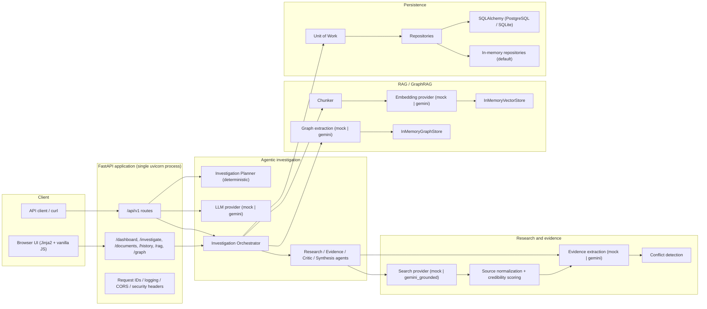
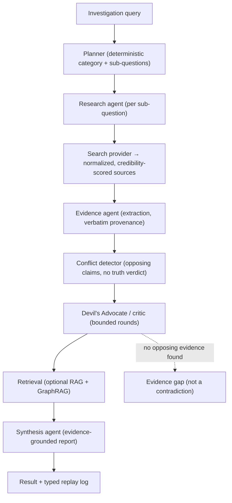
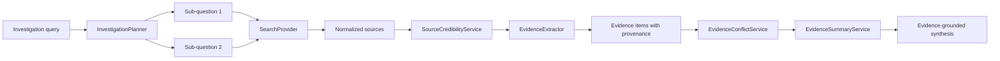
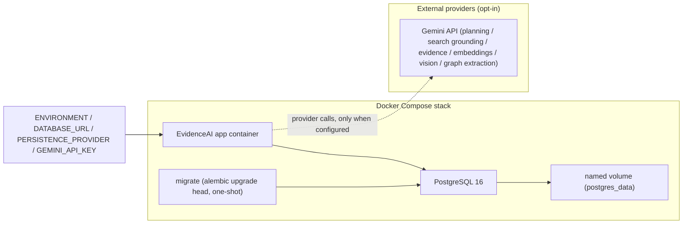

# EvidenceAI - Architecture

This document describes the real architecture of the repository as implemented.
Diagrams use Mermaid and render natively on GitHub.

## A. High-level system



Key facts:

- The browser UI is a thin layer served by the same FastAPI process. It reads
  live data from the same providers as `/api/v1`; there is no separate UI
  database or background worker.
- Persistence is selected with `PERSISTENCE_PROVIDER`: `in_memory` (default,
  process-local) or `sqlalchemy` (PostgreSQL intended, SQLite for local tests).
- The vector store and graph store are currently in-memory only and live inside
  the process (see Limitations).

## B. Investigation pipeline

The bounded agentic workflow executes a finite sequence of application-level
services (no recursion, no self-scheduling, no open-ended tool loop).



Bounds enforced by request validation and the orchestrator:

- Primary research: at most 2 sub-questions, 3 sources per question.
- Critic: defaults to 1 round, hard maximum 2, at most 3 sources per round.
- RAG (`use_rag`): chunks normalized source content, retrieves the most
  relevant chunks per sub-question, and only chunks that pass provenance
  validation reach evidence extraction.
- GraphRAG (`use_graph_rag`): extracts entities/relations, stores nodes and
  edges in the graph store, and combines graph neighbors with vector retrieval.

### Provider flow for a single investigation



The deterministic planner (`app/services/investigation_service.py`) classifies
queries into six categories and produces prioritized sub-questions. The mock
and Gemini providers share the same prompt builders and the same Pydantic
output contract.

## C. Deployment

Two supported deployment paths plus the offline demo.



Notes:

- `compose.yaml` starts PostgreSQL, runs `alembic upgrade head` once via the
  `migrate` service, then starts the app. The app waits for the migrate service
  to complete before serving.
- The Docker image is `python:3.12-slim`, runs as non-root `appuser`, exposes
  port 8000, and has a liveness healthcheck. No API keys are baked into the
  image.
- Production startup fails fast unless `PERSISTENCE_PROVIDER=sqlalchemy` with a
  PostgreSQL `DATABASE_URL`, `DEBUG=false`, and a `GEMINI_API_KEY` whenever a
  Gemini-backed provider is selected.
- The app is designed to run with a single uvicorn worker because the vector
  and graph stores are process-local.

## Directory map

```text
app/
├── agents/          Orchestrator + Research / Evidence / Critic / Synthesis agents
├── ai/              LLM provider contract, mock + Gemini adapters, prompt builders
├── api/             FastAPI routers: /api/v1 (machine) and UI routes
├── core/            Settings, exceptions, logging, middleware
├── database/        Persistence provider, unit of work, repositories, ORM models
├── documents/       Upload validation, extraction (PDF/DOCX/TXT/Image), stores
├── evidence/        Evidence extraction providers + page-aware wrapper
├── graph/           Graph store, builder, retriever, GraphRAG + extraction
├── rag/             Embedding providers, chunker, vector store, retrieval
├── research/        Search provider contract, mock + Gemini grounded search
├── schemas/         Strict Pydantic request/response models
├── services/        Application services (research, evidence, RAG, graph, docs)
├── static/          CSS / JS for the browser UI
├── templates/       Jinja2 templates for the browser UI
└── tests/           Browser-UI HTTP tests (offline)
tests/               Backend pytest suite (offline)
alembic/             Relational schema migrations
scripts/             Opt-in real-provider experiment scripts (require GEMINI_API_KEY)
```

## Honest boundaries

- `POST /api/v1/investigations/agentic`, `POST /api/v1/investigations/research`,
  `POST /api/v1/research/web`, and the browser UI "Run investigation" action
  select their search provider from `SEARCH_PROVIDER` at request time. In
  production (`SEARCH_PROVIDER=gemini_grounded`) they require `GEMINI_API_KEY`;
  with `SEARCH_PROVIDER=mock` they run offline on reserved `*.example` domains.
  `POST /api/v1/research/mock` is the explicit offline-only pipeline.
- `app/api/v1/graph_routes.py` defines `/api/v1/graph/*` and
  `/api/v1/graph-rag/search` but is not currently wired into the router; the
  live graph data endpoint is `GET /api/graph` (browser UI). GraphRAG runs
  inside the agentic workflow via `use_graph_rag`.
- Evidence extraction is strictly source-grounded: the Gemini extractor only
  sees the supplied titles/snippets and requires passages to be verbatim
  substrings of that material. Nothing is fabricated.
